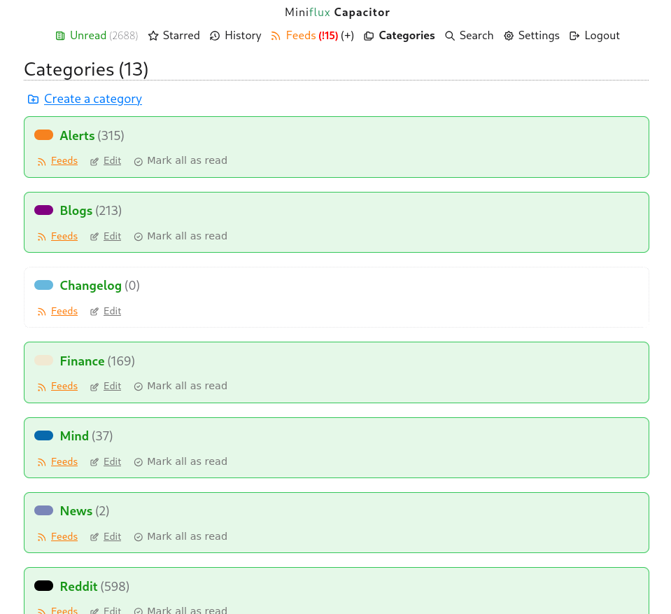
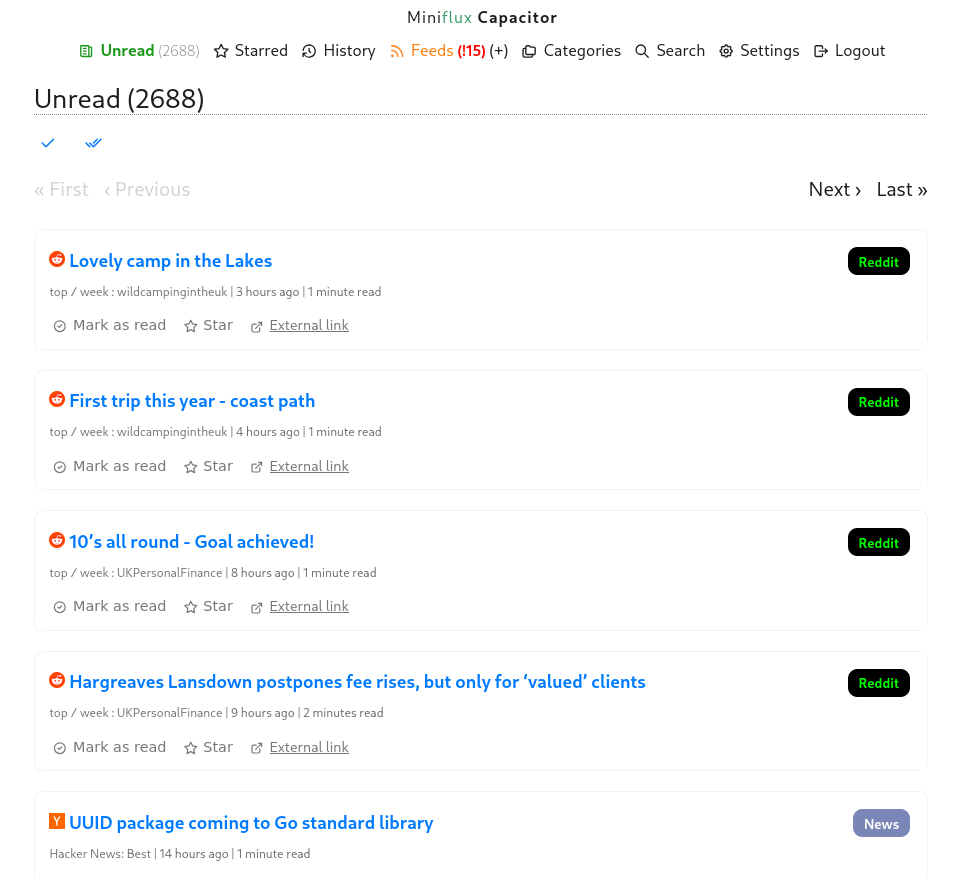
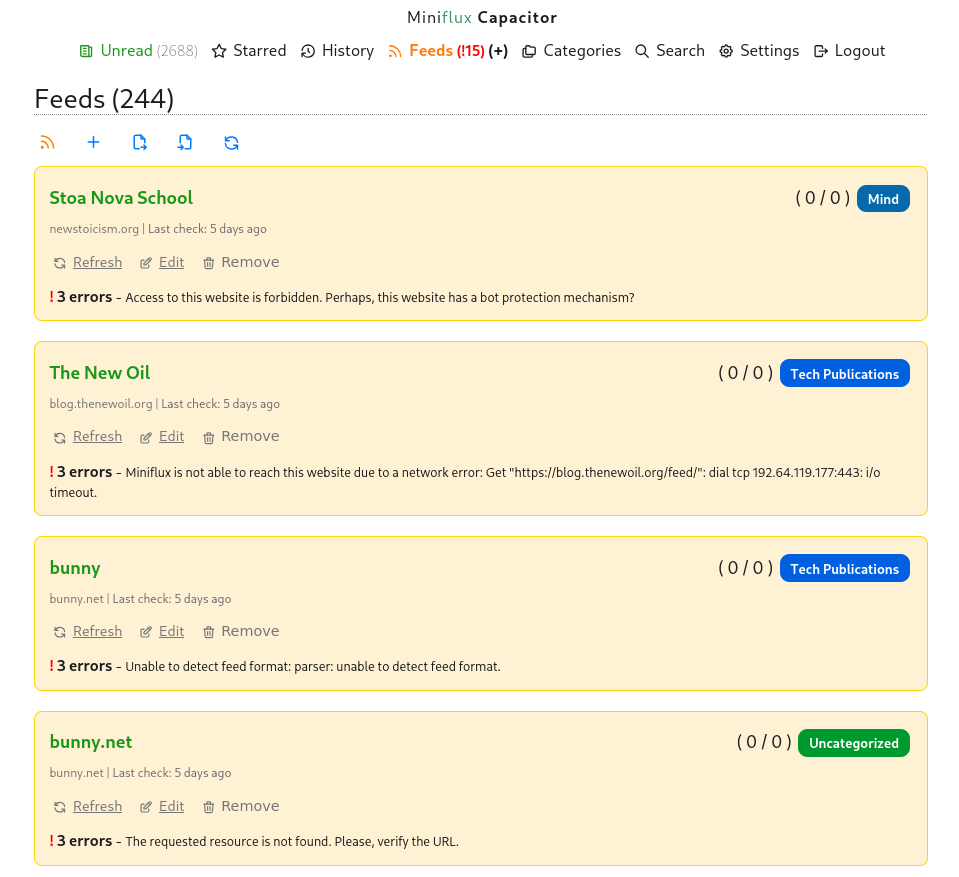
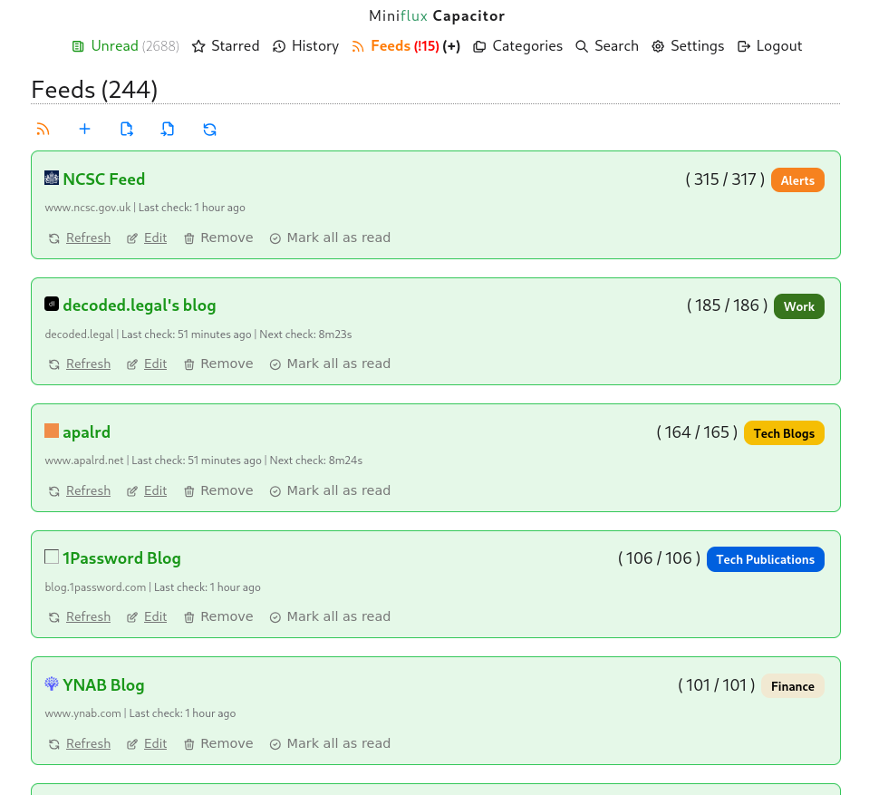
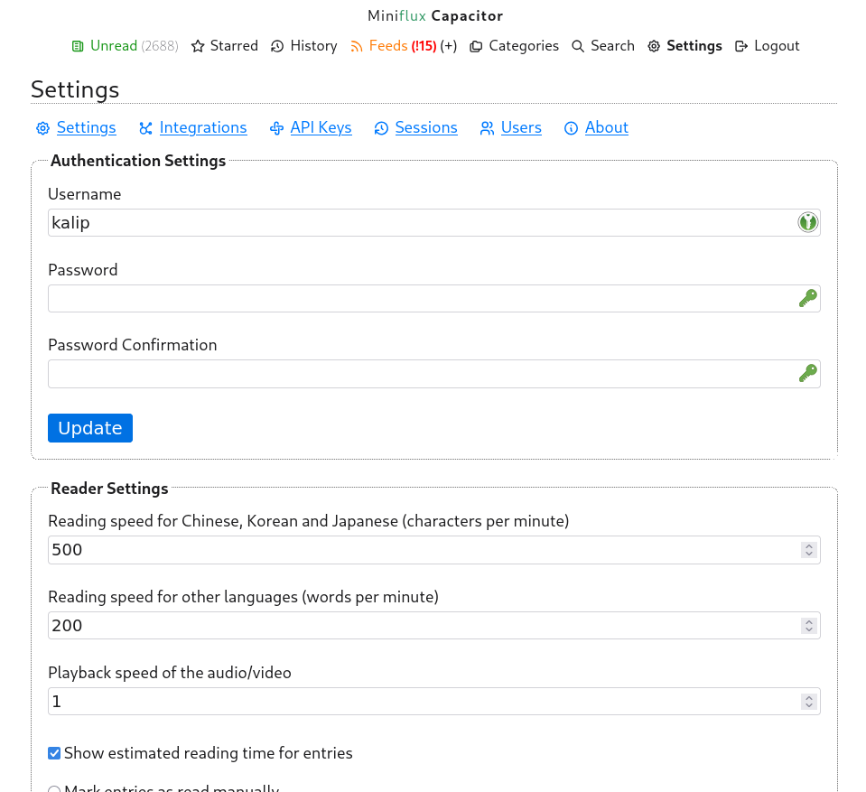
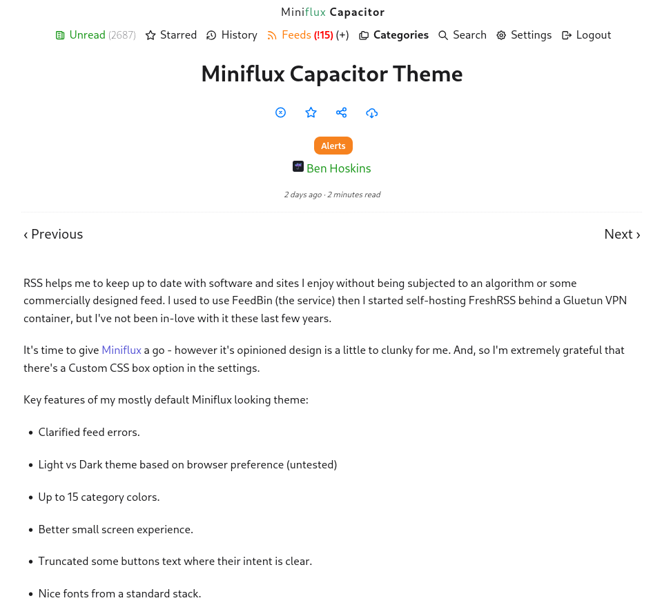

# Miniflux Capacitor Theme

Simply paste the contents of the CSS file into your Miniflux Custom CSS box on the settings page.

See https://benhoskins.dev/miniflux-capacitor-theme/ for more info.

## Todo

- [x] add screenshots
- [ ] fix some link colors
- [ ] add unread icon on all unread item counts?
- [ ] build non-browser JS theme toggle? css exists
- [ ] respect theme changes in app settings? like serif vs not

## Screenshots

